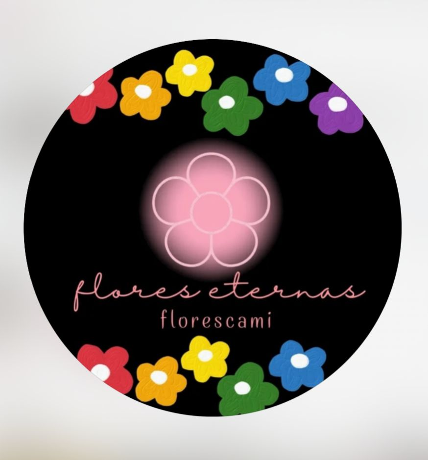

# EJ-RG-2
# 🌸 **Flores Cami**



**Descripción:**  
Flores Cami es un emprendimiento artesanal dedicado a la elaboración de flores eternas y arreglos naturales. 🌷  
Cada diseño es creado con amor y dedicación desde casa, cuidando cada pétalo para transmitir belleza, amor y creatividad. 💐  

---
## 🌿 Pasos para visualizar el proyecto

1. Ingresa al repositorio en GitHub:  
   👉 [https://github.com/camicortes02021-cell/EJ-RG-2](https://github.com/camicortes02021-cell/EJ-RG-2)

2. Explora los archivos y observa cómo está estructurado el proyecto.  

3. Visualiza el archivo `README.md` para conocer la información completa del emprendimiento. 

## 🌼 Características del proyecto

🌹 Elaboración artesanal de flores eternas.  
🌺 Arreglos personalizados según la ocasión.  
💖 Trabajo hecho desde casa con materiales ecológicos.  
🌻 Atención personalizada a cada cliente.

---

## 💻 Ejemplo de código en Python

```python
print("🌸 Bienvenidos a Flores Cami 🌸")
print("Cada flor está hecha con amor y dedicación 💕")


## 💐 Creado con amor por Camila Torres – 2025 💐
